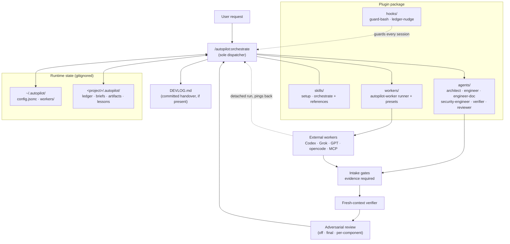

# Autopilot

> A full command loop for Claude Code: plan, dispatch, verify, reconcile.

## TL;DR

Claude Code plugin for jobs too big for one context. It plans, dispatches
fresh-context agents, and distrusts everything that comes back.

- **Task ledger** — work survives restarts and context resets
- **Six native roles + external workers** — Codex, Grok, GPT through one runner
- **Adversarial review** — 2+ independent reviewers assume the code is wrong;
  authors are staked to pass in one round
- **Evidence gates** — same intake for every result, whoever produced it
- **Fails soft** — no external worker or reviewer is ever load-bearing

```text
/plugin marketplace add sayre4ux/autopilot
/plugin install autopilot@autopilot-marketplace
/autopilot:setup
```

Autopilot is an MIT-licensed Claude Code plugin for work that is too large for one context.
It packages a persistent task ledger, self-contained dispatch briefs, six native roles,
adversarial severity-gated review, and an optional registry of external coding workers.

Quality does not depend on which worker produced the change. Every result returns through
the same intake gates, and a fresh-context native verifier gates the cases that need it —
always for external-worker code, plus security, unattended, and weak-evidence work.

## Why

Large agentic jobs fail in predictable ways: the main context fills with mechanical work,
agents assume context they were never given, passing tests hide hardcoded fixtures, and
promised work disappears after interruption. Autopilot turns those failure modes into
explicit mechanics:

- Delegate only when isolation, parallelism, or scale offsets dispatch overhead.
- Give every worker a complete brief with acceptance criteria and redlines.
- Track non-trivial work before acting so restarts do not erase commitments.
- Pit authors against independent adversarial reviewers, with real stakes on both sides.
- Require real evidence, including a successful run for mechanisms.
- Cap retries and change approach instead of repeating a failed invocation.

The doctrine is written for the weakest available orchestrator tier. Model bindings use
aliases, and external workers are optional.

## How it works

The `/autopilot:orchestrate` skill runs a ten-step loop:

```text
restate → check → review mode → route → ticket → decompose
        → dispatch → intake → zoom out → close out
```

### Architecture



Native roles cover architecture, code, visual documents, security, verification, and
review. The orchestrator is the only dispatcher; agents never spawn agents. Work above the
software threshold—more than three files, more than 200 changed lines, or multi-component
design—may auto-enter. Document, deck, visual, and prose work enters only when explicitly
orchestrated.

Dispatched work pings back. A fan-out of external workers runs detached and each one wakes the
dispatching session when it finishes, so the orchestrator ends its turn instead of idling —
which is what makes fan-out usable from a headless `claude -p` session. The runner emits the
callback for CLI workers (Codex, Grok, GPT, opencode) on every exit path; sc-managed agents
carry the send command in their brief; Agent-tool and MCP dispatches are synchronous already.
Without a resolvable callback address every dispatch simply stays synchronous.

Runtime state belongs to the user and project, not the plugin:

| Location | Purpose |
|---|---|
| `~/.autopilot/config.jsonc` | Global role, review, and worker preferences |
| `~/.autopilot/workers/*.json` | Global worker registry |
| `<project>/.autopilot/` | Project overlay, worker overrides, ledger, briefs, artifacts, lessons |

Project records and overlay values override matching global values.

Separately from that gitignored state, a project may keep a committed root `DEVLOG.md` as
its handover surface for any agent harness — a one-screen State header rewritten at each
close-out plus append-only numbered entries with verification evidence. Autopilot
maintains an existing devlog (single writer: the orchestrator) but never creates one
uninvited; reference it from `CLAUDE.md` and `AGENTS.md` so Claude, Codex, and other tools
all find it on a cold pickup.

## Adversarial review

Review is optional (`off`, `final`, `per-component`) and, when it runs, adversarial on
both sides. Producers are briefed to pass in one round: every confirmed blocking finding
is recorded against their work, and disclosure is always cheaper than concealment — a
limitation reported with evidence costs nothing, a defect the panel finds that the report
glossed over costs the most.

The final gate runs a panel of at least two independent reviewers (`reviewPanelSize`,
default 2), launched in parallel with fresh contexts and no visibility into each other,
preferring distinct model families. Each reviewer presumes the deliverable defective and
must earn a `PASS` with evidence of absence. Findings merge by union — one reviewer's
silence never weakens the other's finding — and are cross-scored: confirmed defects a
reviewer missed, and findings that dissolve under the orchestrator's check, are both
recorded and feed future reviewer selection. Blocking findings cap at three rounds before
architect arbitration. A single usable reviewer degrades to a solo review, logged, never a
broken loop.

## Field results

Numbers from one multi-week production build (a Rust sandboxing CLI) run end-to-end under
Autopilot — observational results from real work, not a controlled benchmark:

- Independent cross-family review confirmed **25+ critical/major defects in code that had
  already passed compile and its test suite** — among them an IPv6 containment bypass, a
  destructive-uninstall safety hole, and a teardown race that killed live sessions.
- Two-reviewer panels earned their cost directly: on identical briefs, the reviewers'
  critical findings were **disjoint** — each found criticals the other missed. A solo
  reviewer would have shipped one either way.
- The false-positive filter worked in both directions: 3 review findings were refuted by
  evidence and never reached the implementer.
- Across 54 external-worker dispatches (three model families), **no failed dispatch lost
  work** — every failure recovered by retry, continuation brief, or family switch.
- The project's own test suite grew from 5 to 224 passing tests over the ledger's ~70
  tasks.

## Install

Requires a current Claude Code release with plugin user configuration, agent
`model`/`effort` frontmatter, `best`, and `fallbackModel` support.

From Claude Code, add this repository as a marketplace and install the plugin:

```text
/plugin marketplace add sayre4ux/autopilot
/plugin install autopilot@autopilot-marketplace
```

Then run:

```text
/autopilot:setup
```

Setup is explicit-only. It first inspects the current configuration, then presents one plan
and waits for approval before writing. It can:

- Merge `model: "best"` and a fallback alias list into user settings without replacing
  unrelated keys.
- Extend an existing `availableModels` allowlist; it never creates an allowlist.
- Install a user-level haiku/low Explore override. User level is required because a plugin
  agent cannot shadow the built-in Explore agent.
- Create the runtime skeleton and install the worker runner.

Existing settings are backed up once. Existing Explore and overlay files are diffed, never
blindly replaced. Restart Claude Code after setup so agent and model changes load.

For local development, validate from the repository root:

```bash
claude plugin validate .
```

## Workers

Workers are JSON records validated by
[`workers/registry.schema.json`](workers/registry.schema.json). Three types are supported:

| Type | Invocation |
|---|---|
| `cli` | `~/.autopilot/bin/autopilot-worker` |
| `subagent` | Claude Code Agent tool |
| `mcp` | The record's named MCP tool |

The shipped files in [`workers/presets/`](workers/presets/) are editable examples. Adding a
worker does not require changing the plugin.

A CLI dispatch uses:

```bash
~/.autopilot/bin/autopilot-worker run <worker-id> \
  --brief <absolute-brief-path> \
  --workdir <project-root>
```

The runner substitutes known placeholders as separate arguments, never through a shell. It
enforces timeouts and writes `<task-id>.out` plus `<task-id>.meta.json`. Untrusted records
show the resolved command and require approval; setup never marks one trusted.

External work receives the identical brief and gates as native work. One failed external
run may retry with its failure trail. The second failure escalates to the native engineer,
or security engineer for security work.

### Codex compatibility

Codex works as an external `cli` worker ([`codex-cli.json`](workers/presets/codex-cli.json)
and the `gpt-5.6-*` presets): the brief is delivered over stdin to `codex exec`, the runner
enforces the timeout and emits the completion callback on every exit path, and its
review-capable records make it the preferred independent family for the adversarial panel.
Codex records stay `trusted: false`, so the resolved command requires approval, and they
are marked avoid-when for security-sensitive and visual work.

Known incompatibility: in superconductor/super.engineering-managed sessions, `codex` on
PATH resolves to a wrapper that spawns a session watcher and never exits, so `codex exec`
hangs until killed. Every shipped Codex-based preset therefore sets
`SUPERCONDUCTOR_MANAGED_AGENT=0` to force the wrapper's clean passthrough branch — keep
that override when editing them. Verified against wrapper v3 (2026-07-26): the watcher
still engages whenever a managed session exports the variable as `1`. Invoking the real
binary by absolute path also works.

## Enforcement hooks

Autopilot includes optional fail-open hooks. `advisory` is the default:

- The Bash guard recognizes a deliberately small set of catastrophic commands. Strict mode
  blocks only a positive match; advisory mode warns.
- The Stop hook reminds the session about its active/open ledger rows.
- Any hook parsing, runtime, or platform error allows the operation. A broken hook must not
  brick Bash or trap a session.

Set plugin user configuration `enforcement` to `off`, `advisory`, or `strict`. The plugin
can also be disabled entirely from `/plugin`.

## Degradation

Autopilot has no required external worker or reviewer:

| Failure | Behavior |
|---|---|
| Worker registry empty | Dispatch the matching native role |
| Runner or worker command unavailable | Log the failure and use the native role |
| External worker fails twice | Escalate with its full evidence trail |
| Independent review worker unavailable | Fill the panel with the native reviewer; solo review when only one seat fills |
| Only one model tier available | Keep role separation, strengthen briefs, reduce parallelism |

Aliases (`opus`, `sonnet`, `haiku`) keep role bindings independent of dated model releases.
The system remains functional with review off.

## Uninstall

1. Disable and uninstall `autopilot` with `/plugin`.
2. Remove `~/.autopilot/` if its registries, artifacts, and lessons are no longer needed.
3. Remove `~/.claude/agents/Explore.md` only if setup installed it and you no longer want
   the override.
4. Restore the setup-created pristine settings backup, or remove only the keys you approved
   during setup. Preserve unrelated settings.
5. Restart Claude Code.

Project `.autopilot/` directories contain job history and artifacts; inspect them before
deleting.

## Contributing

See [`docs/design.md`](docs/design.md) for architecture, trust boundaries, and invariants.
Keep user-specific configuration outside the plugin, preserve native degradation, and add
real-run evidence for mechanism changes.

## License

[MIT](LICENSE)

## Star History

[](https://www.star-history.com/#sayre4ux/autopilot&Date)
